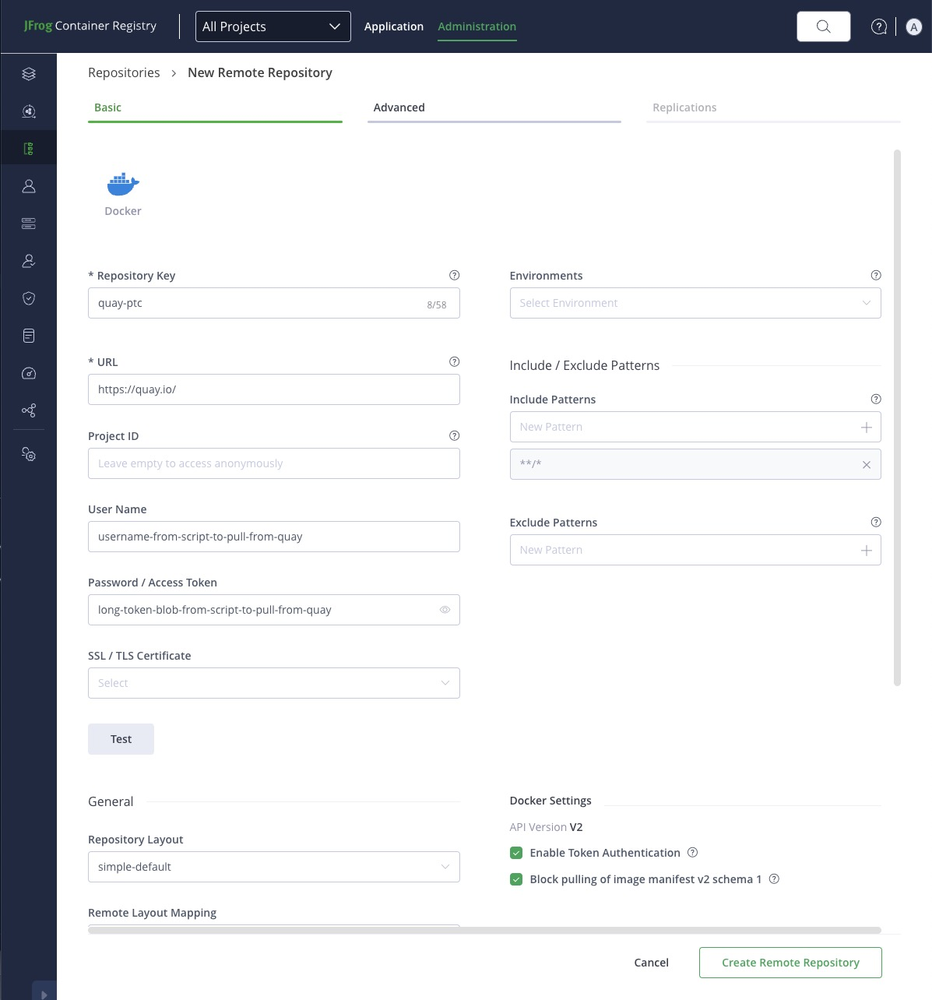
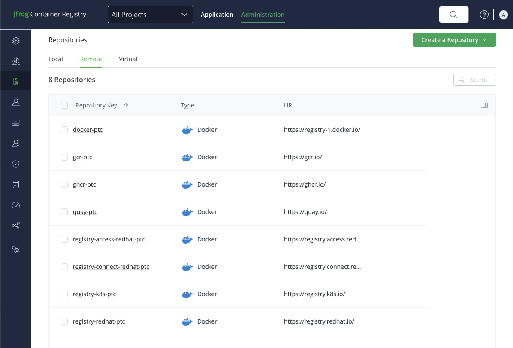

# Pull-through Proxy Cache - JFrog Artifactory

This document will guide you in setting up JFrog Artifactory to act as a Pull-through/Proxy Cache for container images.

## Prerequisites

- Obtain Red Hat Pull Secret: https://console.redhat.com/openshift/downloads#tool-pull-secret
- Store the Red Hat Pull Secret in a file such as `rh-pull-secret.json`
- `jq`

## 1. Extracting the Pull Secret bits

To set up a Remote repo in JFrog, you'll need to provide it some credentials.  This is unique to each Remote repo, and not something you can pass in with a giant pull secret blob.  You need the separate plain text components of the Username and Password encoded in a Pull Secret.

To make quick work of this, you can use the [./scripts/pull-secret-to-parts.sh](../scripts/pull-secret-to-parts.sh) helper script to take your normal Red Hat Pull Secret JSON file and extract it into separate parts, displaying the credentials you need to be used with JFrog.

---

## 2. Create a New Remote Repository

In JFrog, navigate to the **Administration** side of the dashboard, then to **Repositories**.  Hover over the **New Repository** button which will let you click the **Remote** option.

Configure it as shown below - key parts are:

- Repository Type: Docker
- Repository Key: quay-ptc
- URL: https://quay.io
- User Name: username-from-pull-secret-helper-script
- Password / Access Token: password-from-pull-secret-helper-script
- Enable Token Authentication: Checked
- Block pulling of image manifest v2 schema 1: Checked

> Rinse and repeat for the other remote registries - your list may end up looking something like this:

---

## 3. Configure Authentication

At this point you may create or use an existing Group/User and provide it access to pull/push from those Remote Repositories you just created.

I personally have not found Access Tokens to work with OpenShift and JFrog, use a user:pass combo - for that you may want a specific one that is read-only for OpenShift to use to pull with, keep the push permissions to the mirroring pipeline.

---

## An Aside: Access Methods

Depending on how you have JFrog configured, you may access your repository with different patterns.

- In **Sub Domain** mode, you would use `quay-ptc.jfrog.example.com` - meaning anything you want to get from Quay like `quay.io/kenmoini/banana-phone:latest` you can get through `quay-ptc.jfrog.example.com/kenmoini/banana-phone:latest`.
- In **Repository Path** mode, you would use `jfrog.example.com/quay-ptc/` - meaning anything you want to get from Quay like `quay.io/kenmoini/banana-phone:latest` you can get through `jfrog.example.com/quay-ptc/kenmoini/banana-phone:latest`
- In **Port** mode, you would use `jfrog.example.com:NUMBER_TO_REGISTRY` - meaning anything you want to get from Quay like `quay.io/kenmoini/banana-phone:latest` you can get through `jfrog.example.com:NUMBER_TO_REGISTRY/kenmoini/banana-phone:latest`.  Each repository gets its own unique port to access from.  *Don't do this if you don't have to.*
